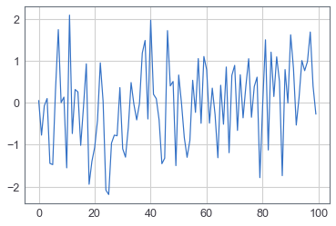
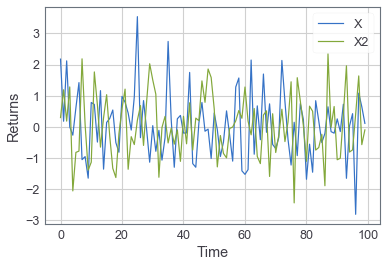
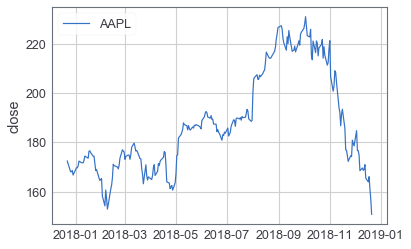
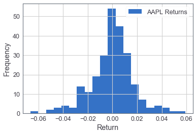
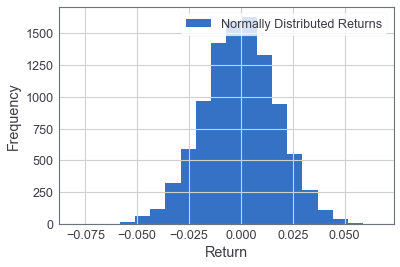

# Introduction to Research (Jupyter ENV)
by JunPyo Park

Part of the Alpha Square Lecture Series:

* [blog.alphasquare.co.kr](http://blog.alphasquare.co.kr)
* [junpyopark.github.io](https://junpyopark.github.io)


---
앞으로의 리서치 환경으로 쓰일 주피터 노트북 기초와 간단한 plot 메서드들을 살펴봅니다.

# 주피터 노트북 환경 살펴보기

데이터 분석은 주피터 노트북 환경(IPython notebook environment)를 활용합니다. 몇가지 간단한 기능들을 소개하려 합니다.

## 코드 셀 vs 텍스트 셀

각각의 셀들은 코드를 담거나 텍스트를 담을 수 있습니다. 셀을 클릭 후 m 을 누르면 텍스트 셀(Markdown)로 활용할 수 있고 y 를 누르면 코드 셀로 활용할 수 있습니다.

## 명령어 실행하기

코드 셀은 실행 버튼을 누르거나 셀에서 쉬프트 엔터를 누르면 실행됩니다. 코드 셀에 명령어를 입력한 뒤 실행하면 각 줄의 내용이 실행되어 지고 결괏값이 셀의 마지막줄 아래에 출력됩니다.


```python
2 + 2
```


    4


출력값이 없는 셀도 있을 수 있습니다. 다음과 같이 변수에 값을 할당하는 경우 입니다.


```python
X = 2
```

가장 마지막 줄에 있는 결괏값만 출력되어 집니다.


```python
2 + 2
3 + 3
```


    6


마지막 줄이 아닌 곳의 값을 출력 하려면 ```print``` 명령어를 사용합니다.


```python
print(2 + 2)
3 + 3
```

    4
    


    6


## 셀이 동작하고 있을 경우

셀이 동작하고 있을 경우 ```[*]``` 기호가 왼쪽에 표시됩니다. 실행 되지 않은 셀의 경우 ```[]``` 기호가 표시됩니다. 실행된 셀은 ```[5]``` 와 같이 몇 번째 순서로 실행되었는지 그 숫자가 표기됩니다. 다음 셀을 실행 시키고 어떤 일이 벌어지는지 잘 관찰해 보세요.


```python
# 시간이 걸리는 코드를 작성해 보았습니다.
c = 0
for i in range(10000000):
    c = c + i
c
```


    49999995000000


## 라이브러리 불러오기

대부분 작업의 경우 미리 만들어진 라이브러리에서 함수를 불러와 사용하게 됩니다. 아나콘다 환경에서는 기본적인 라이브러리들이 설치되어 있으며 설치되지 않은 라이브러리는 pip 명령어 등으로 설치하여 불러올 수 있습니다. 설치된 라이브러리는 ```import``` 명령어를 통해 불러올 수 있습니다.


```python
import numpy as np
import pandas as pd
import matplotlib.pyplot as plt
```

라이브러리를 불러온 후 ```as``` 라는 명령어를 통해 이름을 재설정 할 수 있습니다. numpy 라이브러리에는 ```np``` 라는 이름을 pandas 라이브러리에는 ```pd``` 라는 이름을 지정하였습니다. 이는 대부분의 코드에서 보편적으로 사용하는 이름입니다. 이처럼 라이브러리를 자주 호출하는 경우 단순한 이름으로 재설정하여 쉽게 접근할 수 있습니다.

## Tab 자동완성 기능

탭키를 누르면 주피터 노트북에서 다음에 쓸 명령어나 변수이름를 자동으로 추천하여 보여주거나 해당하는 값이 하나라면 자동으로 완성시켜 줍니다. 이는 코드를 작성할 때 많은 시간을 절약할 수 있도록 해줍니다. 이 기능을 활용하여 라이브러리에 어떤 함수들이 있는지 확인하는것도 가능합니다.

다음 셀에서 커서를 ```.``` 뒤에 두고 탭을 눌러보세요.


```python
np.random.
```

## Documentation 도움말 보기

물음표를 함수 뒤에 입력하고 해당 셀을 실행하면 주피터가 해당 함수에 대한 documentation을 보여줍니다. 코드가 재실행 되는것을 방지하기 위해 새로운 셀에서 이런 도움말 기능을 실행하면 편리합니다.


```python
np.random.normal?
```

## Sampling 하기

```numpy```의 여러 함수들을 통해 랜덤한 데이터를 샘플링 할 수 있습니다.


```python
# 평균이 0 이고 분산이 1 인 정규분포에서
# 100개의 데이터를 다음과 같이 추출할 수 있습니다.
X = np.random.normal(0, 1, 100)
```

## Plotting 하기

이전에 불러온 plt 라이브러리를 통해 그래프를 그릴 수 있습니다.


```python
plt.plot(X)
```


    [<matplotlib.lines.Line2D at 0x22bfe4bd710>]


### Line Output 제거하기

위 출력결과를 보면 ```[<matplotlib.lines.Line2D at 0x160c22db240>]``` 와 같이 문구가 그래프와 같이 출력된것을 볼 수 있습니다. 이를 없애기 위해 다음과 같이 마지막에 세미콜론을 붙여줍니다.


```python
plt.plot(X);
```





### 축에 이름 설정하기

```plt.xlabel``` 또는 ```plt.ylabel``` 명령어를 통해 각각 x축, y축의 이름을 지정할 수 있습니다.


```python
X = np.random.normal(0, 1, 100)
X2 = np.random.normal(0, 1, 100)

plt.plot(X);
plt.plot(X2);
plt.xlabel('Time') 
plt.ylabel('Returns')
plt.legend(['X', 'X2']);
```





## 통계량(statistics) 계산하기

```numpy```를 활용해서 간단한 통계량들을 쉽게 계산할 수 있습니다.


```python
# 평균
np.mean(X)
```


    0.1230036394638333


```python
# 표준편차
np.std(X)
```


    1.051931761394475


## 주가 데이터 불러오기

http://blog.naver.com/anthouse28/221408163989 참고해 주세요


```python
import pandas_datareader.data as web

data = web.DataReader('AAPL', 'robinhood')
```


```python
data
```


<div>
<style scoped>
    .dataframe tbody tr th:only-of-type {
        vertical-align: middle;
    }

    .dataframe tbody tr th {
        vertical-align: top;
    }

    .dataframe thead th {
        text-align: right;
    }
</style>
<table border="1" class="dataframe">
  <thead>
    <tr style="text-align: right;">
      <th></th>
      <th></th>
      <th>close_price</th>
      <th>high_price</th>
      <th>interpolated</th>
      <th>low_price</th>
      <th>open_price</th>
      <th>session</th>
      <th>volume</th>
    </tr>
    <tr>
      <th>symbol</th>
      <th>begins_at</th>
      <th></th>
      <th></th>
      <th></th>
      <th></th>
      <th></th>
      <th></th>
      <th></th>
    </tr>
  </thead>
  <tbody>
    <tr>
      <th rowspan="61" valign="top">AAPL</th>
      <th>2017-12-22</th>
      <td>172.421400</td>
      <td>172.829300</td>
      <td>False</td>
      <td>171.919000</td>
      <td>172.096300</td>
      <td>reg</td>
      <td>16349444</td>
    </tr>
    <tr>
      <th>2017-12-26</th>
      <td>168.047100</td>
      <td>168.933800</td>
      <td>False</td>
      <td>167.169300</td>
      <td>168.273700</td>
      <td>reg</td>
      <td>33185536</td>
    </tr>
    <tr>
      <th>2017-12-27</th>
      <td>168.076600</td>
      <td>168.254000</td>
      <td>False</td>
      <td>167.199800</td>
      <td>167.584000</td>
      <td>reg</td>
      <td>21498213</td>
    </tr>
    <tr>
      <th>2017-12-28</th>
      <td>168.549500</td>
      <td>169.308200</td>
      <td>False</td>
      <td>167.958400</td>
      <td>168.470700</td>
      <td>reg</td>
      <td>16480187</td>
    </tr>
    <tr>
      <th>2017-12-29</th>
      <td>166.726900</td>
      <td>168.066800</td>
      <td>False</td>
      <td>166.717100</td>
      <td>167.997800</td>
      <td>reg</td>
      <td>25999922</td>
    </tr>
    <tr>
      <th>2018-01-02</th>
      <td>169.712100</td>
      <td>169.751500</td>
      <td>False</td>
      <td>166.756500</td>
      <td>167.643100</td>
      <td>reg</td>
      <td>25555934</td>
    </tr>
    <tr>
      <th>2018-01-03</th>
      <td>169.682500</td>
      <td>171.968200</td>
      <td>False</td>
      <td>169.416500</td>
      <td>169.978100</td>
      <td>reg</td>
      <td>29517899</td>
    </tr>
    <tr>
      <th>2018-01-04</th>
      <td>170.470700</td>
      <td>170.904200</td>
      <td>False</td>
      <td>169.534700</td>
      <td>169.987900</td>
      <td>reg</td>
      <td>22434597</td>
    </tr>
    <tr>
      <th>2018-01-05</th>
      <td>172.411600</td>
      <td>172.776100</td>
      <td>False</td>
      <td>170.490400</td>
      <td>170.874600</td>
      <td>reg</td>
      <td>23660018</td>
    </tr>
    <tr>
      <th>2018-01-08</th>
      <td>171.771200</td>
      <td>173.012500</td>
      <td>False</td>
      <td>171.357400</td>
      <td>171.771200</td>
      <td>reg</td>
      <td>20567766</td>
    </tr>
    <tr>
      <th>2018-01-09</th>
      <td>171.751500</td>
      <td>172.470700</td>
      <td>False</td>
      <td>170.845100</td>
      <td>171.968200</td>
      <td>reg</td>
      <td>21583997</td>
    </tr>
    <tr>
      <th>2018-01-10</th>
      <td>171.712100</td>
      <td>171.721900</td>
      <td>False</td>
      <td>170.441100</td>
      <td>170.598800</td>
      <td>reg</td>
      <td>23959895</td>
    </tr>
    <tr>
      <th>2018-01-11</th>
      <td>172.687400</td>
      <td>172.892900</td>
      <td>False</td>
      <td>171.909100</td>
      <td>172.007600</td>
      <td>reg</td>
      <td>18667729</td>
    </tr>
    <tr>
      <th>2018-01-12</th>
      <td>174.470600</td>
      <td>174.736700</td>
      <td>False</td>
      <td>173.051900</td>
      <td>173.574100</td>
      <td>reg</td>
      <td>25418080</td>
    </tr>
    <tr>
      <th>2018-01-16</th>
      <td>173.584000</td>
      <td>176.736600</td>
      <td>False</td>
      <td>173.534700</td>
      <td>175.268700</td>
      <td>reg</td>
      <td>29565947</td>
    </tr>
    <tr>
      <th>2018-01-17</th>
      <td>176.450900</td>
      <td>176.598700</td>
      <td>False</td>
      <td>172.480500</td>
      <td>173.544500</td>
      <td>reg</td>
      <td>34386836</td>
    </tr>
    <tr>
      <th>2018-01-18</th>
      <td>176.608500</td>
      <td>177.436100</td>
      <td>False</td>
      <td>175.613500</td>
      <td>176.716900</td>
      <td>reg</td>
      <td>31193352</td>
    </tr>
    <tr>
      <th>2018-01-19</th>
      <td>175.820400</td>
      <td>176.923800</td>
      <td>False</td>
      <td>174.785900</td>
      <td>175.968200</td>
      <td>reg</td>
      <td>32425067</td>
    </tr>
    <tr>
      <th>2018-01-22</th>
      <td>174.382000</td>
      <td>175.150400</td>
      <td>False</td>
      <td>173.989500</td>
      <td>174.677500</td>
      <td>reg</td>
      <td>27108551</td>
    </tr>
    <tr>
      <th>2018-01-23</th>
      <td>174.421400</td>
      <td>176.785900</td>
      <td>False</td>
      <td>174.204600</td>
      <td>174.677500</td>
      <td>reg</td>
      <td>32689146</td>
    </tr>
    <tr>
      <th>2018-01-24</th>
      <td>171.643100</td>
      <td>174.677500</td>
      <td>False</td>
      <td>170.638200</td>
      <td>174.628300</td>
      <td>reg</td>
      <td>51105090</td>
    </tr>
    <tr>
      <th>2018-01-25</th>
      <td>168.579100</td>
      <td>172.362300</td>
      <td>False</td>
      <td>168.007700</td>
      <td>171.923900</td>
      <td>reg</td>
      <td>41529004</td>
    </tr>
    <tr>
      <th>2018-01-26</th>
      <td>168.973200</td>
      <td>169.455900</td>
      <td>False</td>
      <td>167.544600</td>
      <td>169.455900</td>
      <td>reg</td>
      <td>39143011</td>
    </tr>
    <tr>
      <th>2018-01-29</th>
      <td>165.475700</td>
      <td>167.643100</td>
      <td>False</td>
      <td>164.598900</td>
      <td>167.643100</td>
      <td>reg</td>
      <td>50640406</td>
    </tr>
    <tr>
      <th>2018-01-30</th>
      <td>164.500300</td>
      <td>164.894400</td>
      <td>False</td>
      <td>162.263900</td>
      <td>163.076700</td>
      <td>reg</td>
      <td>46048185</td>
    </tr>
    <tr>
      <th>2018-01-31</th>
      <td>164.953500</td>
      <td>165.950300</td>
      <td>False</td>
      <td>164.037300</td>
      <td>164.401800</td>
      <td>reg</td>
      <td>32478930</td>
    </tr>
    <tr>
      <th>2018-02-01</th>
      <td>165.298400</td>
      <td>166.125900</td>
      <td>False</td>
      <td>164.293400</td>
      <td>164.692400</td>
      <td>reg</td>
      <td>47230787</td>
    </tr>
    <tr>
      <th>2018-02-02</th>
      <td>158.126000</td>
      <td>164.332800</td>
      <td>False</td>
      <td>157.731900</td>
      <td>163.544700</td>
      <td>reg</td>
      <td>86593825</td>
    </tr>
    <tr>
      <th>2018-02-05</th>
      <td>154.175300</td>
      <td>161.456000</td>
      <td>False</td>
      <td>153.692600</td>
      <td>156.746700</td>
      <td>reg</td>
      <td>72738522</td>
    </tr>
    <tr>
      <th>2018-02-06</th>
      <td>160.618600</td>
      <td>161.298400</td>
      <td>False</td>
      <td>151.722200</td>
      <td>152.539900</td>
      <td>reg</td>
      <td>68243838</td>
    </tr>
    <tr>
      <th>...</th>
      <td>...</td>
      <td>...</td>
      <td>...</td>
      <td>...</td>
      <td>...</td>
      <td>...</td>
      <td>...</td>
    </tr>
    <tr>
      <th>2018-11-09</th>
      <td>204.470000</td>
      <td>206.010000</td>
      <td>False</td>
      <td>202.250000</td>
      <td>205.550000</td>
      <td>reg</td>
      <td>34365750</td>
    </tr>
    <tr>
      <th>2018-11-12</th>
      <td>194.170000</td>
      <td>199.850000</td>
      <td>False</td>
      <td>193.790000</td>
      <td>199.000000</td>
      <td>reg</td>
      <td>51135518</td>
    </tr>
    <tr>
      <th>2018-11-13</th>
      <td>192.230000</td>
      <td>197.180000</td>
      <td>False</td>
      <td>191.450100</td>
      <td>191.630000</td>
      <td>reg</td>
      <td>46882936</td>
    </tr>
    <tr>
      <th>2018-11-14</th>
      <td>186.800000</td>
      <td>194.480000</td>
      <td>False</td>
      <td>185.930000</td>
      <td>193.900000</td>
      <td>reg</td>
      <td>60800957</td>
    </tr>
    <tr>
      <th>2018-11-15</th>
      <td>191.410000</td>
      <td>191.970000</td>
      <td>False</td>
      <td>186.900000</td>
      <td>188.390000</td>
      <td>reg</td>
      <td>46478801</td>
    </tr>
    <tr>
      <th>2018-11-16</th>
      <td>193.530000</td>
      <td>194.969500</td>
      <td>False</td>
      <td>189.460000</td>
      <td>190.500000</td>
      <td>reg</td>
      <td>36928253</td>
    </tr>
    <tr>
      <th>2018-11-19</th>
      <td>185.860000</td>
      <td>190.700000</td>
      <td>False</td>
      <td>184.990000</td>
      <td>190.000000</td>
      <td>reg</td>
      <td>41925292</td>
    </tr>
    <tr>
      <th>2018-11-20</th>
      <td>176.980000</td>
      <td>181.470000</td>
      <td>False</td>
      <td>175.510000</td>
      <td>178.370000</td>
      <td>reg</td>
      <td>67825247</td>
    </tr>
    <tr>
      <th>2018-11-21</th>
      <td>176.780000</td>
      <td>180.270000</td>
      <td>False</td>
      <td>176.550000</td>
      <td>179.730000</td>
      <td>reg</td>
      <td>31124210</td>
    </tr>
    <tr>
      <th>2018-11-23</th>
      <td>172.290000</td>
      <td>176.595000</td>
      <td>False</td>
      <td>172.100000</td>
      <td>174.940000</td>
      <td>reg</td>
      <td>23623972</td>
    </tr>
    <tr>
      <th>2018-11-26</th>
      <td>174.620000</td>
      <td>174.950000</td>
      <td>False</td>
      <td>170.260000</td>
      <td>174.240000</td>
      <td>reg</td>
      <td>44998520</td>
    </tr>
    <tr>
      <th>2018-11-27</th>
      <td>174.240000</td>
      <td>174.770000</td>
      <td>False</td>
      <td>170.880000</td>
      <td>171.510000</td>
      <td>reg</td>
      <td>41387377</td>
    </tr>
    <tr>
      <th>2018-11-28</th>
      <td>180.940000</td>
      <td>181.290000</td>
      <td>False</td>
      <td>174.930000</td>
      <td>176.730000</td>
      <td>reg</td>
      <td>46062539</td>
    </tr>
    <tr>
      <th>2018-11-29</th>
      <td>179.550000</td>
      <td>182.800000</td>
      <td>False</td>
      <td>177.700000</td>
      <td>182.660000</td>
      <td>reg</td>
      <td>41769992</td>
    </tr>
    <tr>
      <th>2018-11-30</th>
      <td>178.580000</td>
      <td>180.330000</td>
      <td>False</td>
      <td>177.030000</td>
      <td>180.290000</td>
      <td>reg</td>
      <td>39531549</td>
    </tr>
    <tr>
      <th>2018-12-03</th>
      <td>184.820000</td>
      <td>184.940000</td>
      <td>False</td>
      <td>181.210000</td>
      <td>184.460000</td>
      <td>reg</td>
      <td>40802482</td>
    </tr>
    <tr>
      <th>2018-12-04</th>
      <td>176.690000</td>
      <td>182.389900</td>
      <td>False</td>
      <td>176.270000</td>
      <td>180.950000</td>
      <td>reg</td>
      <td>41344282</td>
    </tr>
    <tr>
      <th>2018-12-05</th>
      <td>176.690000</td>
      <td>176.690000</td>
      <td>True</td>
      <td>176.690000</td>
      <td>176.690000</td>
      <td>reg</td>
      <td>0</td>
    </tr>
    <tr>
      <th>2018-12-06</th>
      <td>174.720000</td>
      <td>174.780000</td>
      <td>False</td>
      <td>170.420000</td>
      <td>171.760000</td>
      <td>reg</td>
      <td>43098410</td>
    </tr>
    <tr>
      <th>2018-12-07</th>
      <td>168.490000</td>
      <td>174.490000</td>
      <td>False</td>
      <td>168.300000</td>
      <td>173.490000</td>
      <td>reg</td>
      <td>42281631</td>
    </tr>
    <tr>
      <th>2018-12-10</th>
      <td>169.600000</td>
      <td>170.090000</td>
      <td>False</td>
      <td>163.330000</td>
      <td>165.000000</td>
      <td>reg</td>
      <td>62025994</td>
    </tr>
    <tr>
      <th>2018-12-11</th>
      <td>168.630000</td>
      <td>171.790000</td>
      <td>False</td>
      <td>167.000000</td>
      <td>171.660000</td>
      <td>reg</td>
      <td>47281665</td>
    </tr>
    <tr>
      <th>2018-12-12</th>
      <td>169.100000</td>
      <td>171.920000</td>
      <td>False</td>
      <td>169.020000</td>
      <td>170.400000</td>
      <td>reg</td>
      <td>35627674</td>
    </tr>
    <tr>
      <th>2018-12-13</th>
      <td>170.950000</td>
      <td>172.570000</td>
      <td>False</td>
      <td>169.550000</td>
      <td>170.490000</td>
      <td>reg</td>
      <td>31898647</td>
    </tr>
    <tr>
      <th>2018-12-14</th>
      <td>165.480000</td>
      <td>169.080000</td>
      <td>False</td>
      <td>165.280000</td>
      <td>169.000000</td>
      <td>reg</td>
      <td>40703710</td>
    </tr>
    <tr>
      <th>2018-12-17</th>
      <td>163.940000</td>
      <td>168.350000</td>
      <td>False</td>
      <td>162.730000</td>
      <td>165.450000</td>
      <td>reg</td>
      <td>44287922</td>
    </tr>
    <tr>
      <th>2018-12-18</th>
      <td>166.070000</td>
      <td>167.530000</td>
      <td>False</td>
      <td>164.390000</td>
      <td>165.380000</td>
      <td>reg</td>
      <td>33841518</td>
    </tr>
    <tr>
      <th>2018-12-19</th>
      <td>160.890000</td>
      <td>167.450000</td>
      <td>False</td>
      <td>159.090000</td>
      <td>166.000000</td>
      <td>reg</td>
      <td>49047297</td>
    </tr>
    <tr>
      <th>2018-12-20</th>
      <td>156.830000</td>
      <td>162.110000</td>
      <td>False</td>
      <td>155.300000</td>
      <td>160.400000</td>
      <td>reg</td>
      <td>64772960</td>
    </tr>
    <tr>
      <th>2018-12-21</th>
      <td>150.730000</td>
      <td>158.160000</td>
      <td>False</td>
      <td>149.630000</td>
      <td>156.860000</td>
      <td>reg</td>
      <td>95744584</td>
    </tr>
  </tbody>
</table>
<p>252 rows × 7 columns</p>
</div>


```data``` 변수는 pandas.DataFrame 형태를 가지고 있습니다. 
[자세한 설명 보기](http://pandas.pydata.org/pandas-docs/stable/10min.html).


```python
X = data.loc['AAPL']['close_price'].astype('float')
```


```python
plt.plot(X.index, X.values)
plt.ylabel('close')
plt.legend(['AAPL']);
```





실제 데이터에서 통계량을 계산할 수 있습니다.


```python
np.mean(X)
```


    188.02081944444456


```python
np.std(X)
```


    20.454761929633772


## 가격으로 부터 수익률 계산하기

```pct_change```(percent change) 라는 함수를 사용하여 일간 수익률을 쉽게 계산할 수 있습니다.


```python
R = X.pct_change()
```


```python
R.head()
```


    begins_at
    2017-12-22         NaN
    2017-12-26   -0.025370
    2017-12-27    0.000176
    2017-12-28    0.002814
    2017-12-29   -0.010813
    Name: close_price, dtype: float64


R 값을 확인해 보면 처음 데이터의 경우 기준이 되는 이전일의 데이터가 없기 때문에 NaN(Not a Number)라는 값이 저장되어 있습니다. 다음과 같은 조작을 통해 이 값을 없앨 수 있습니다.


```python
R = X.pct_change()[1:]
```


```python
R.head()
```


    begins_at
    2017-12-26   -0.025370
    2017-12-27    0.000176
    2017-12-28    0.002814
    2017-12-29   -0.010813
    2018-01-02    0.017905
    Name: close_price, dtype: float64


```plt.hist``` 함수를 사용하여 일간 수익률 히스토그램을 그려보도록 하겠습니다.


```python
# 구간의 범위를 몇 등분 할것인지 bins 개수를 통해 조절 가능합니다.
plt.hist(R, bins=20)
plt.xlabel('Return')
plt.ylabel('Frequency')
plt.legend(['AAPL Returns']);
```





통계량을 계산해 봅시다.


```python
np.mean(R)
```


    -0.0003816818079786287


```python
np.std(R)
```


    0.017506270274000497


위의 수익률 데이터로 부터 측정된 평균과 표준편차 값을 바탕으로 정규분포를 그려 보도록 하겠습니다. 그려진 정규분포와 실제 데이터의 수익률 분포 비교를 통해 실제 수익률이 정규분포를 따르는지 추정해 볼 수 있습니다.


```python
plt.hist(np.random.normal(np.mean(R), np.std(R), 10000), bins=20)
plt.xlabel('Return')
plt.ylabel('Frequency')
plt.legend(['Normally Distributed Returns']);
```





유사한 형태를 보이지만 완전히 같다고는 보기 힘들다 생각됩니다. 일단 오늘은 이렇게 간단히 히스토그램을 그려 모양을 통해 추정해 보는것으로 글을 마치도록 하겠습니다. 실제데이터가 조금더 엄밀하게 정규분포를 따르는지 확인하려면 자크베라의 정규성 검정(Jacque-Bera Normality test)과 같은 방식을 활용해야 합니다. 이는 추후 가설 검정 부분 이후 소개하도록 하겠습니다.
